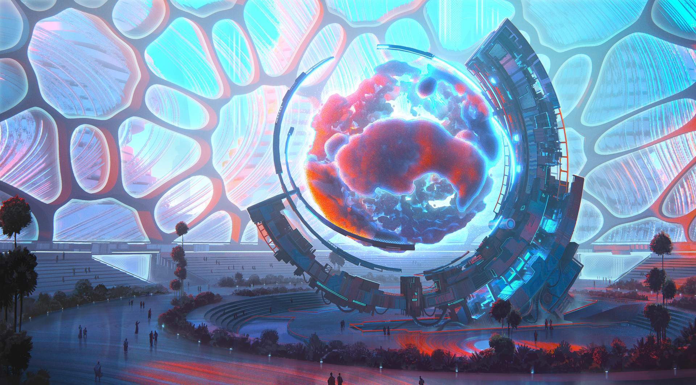

# #100DaysofStory: 

    DRAFT- ~ Entity  

---

## SomeDate, 2019

| Time  | Total | In    | Out   |
| ----- | ----- | ----- | ----- |
| Prep  | --:-- | --:-- | --:-- |
| Write | --:-- | --:-- | --:-- |

Visual Inspiration: Leon Tukker - [Gazorian Parliament](https://www.artstation.com/artwork/oOx2Lw)

Musical Inspiration:

---

## Background

### Notes

### Characters

### Settings

## Entity

Of course a planet like Gazoria-x would have a badly functioning political system as well. Reformicans and Demolitioncrats, Factscists and Crapcheckers. Luckily there is one president ,person, object, thing, keeping all the squabling parties in check: A gaseous being that resides in the middle of parliament, parties visit the entity conveniently named: 'the entity' with their law propositions and their accusations. The entity, being an all knowing entity of course, already has the answer before the politicians even enter the dome shaped parliament. Of course it's up to the interpreters to decipher the various genious inventions disguised as fart noises and other otherwordly outings.

